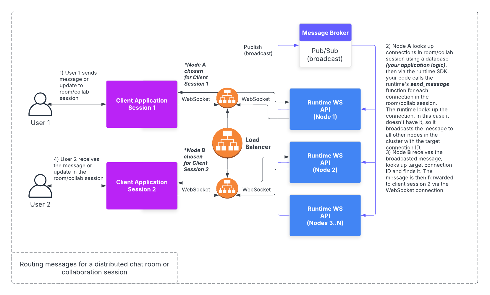

# Scalable WebSockets

## Overview

The Celerity runtime supports deployment as a horizontally scalable cluster of WebSocket servers.
The approach is to allow for multiple WebSocket servers to be deployed in a way in which it does not matter which server a client connects to. This is made possible by using a shared message broker that is used to broadcast messages to all nodes in the cluster. Each node will then filter messages received from other nodes based on the target connection ID for the message and the clients that are connected to the node.

The Celerity runtime uses Redis pub/sub as the built-in message broker for broadcasting messages to all nodes in the cluster. This allows for a scalable and efficient way to handle WebSocket connections and messages.

## Broadcasting & Acknowledgements

Every time a message is broadcast to the cluster, the unique identifier of the source node will need to be included to allow for listening for acknowledgements that will be broadcast by the upstream node that is connected to the target connection ID for the message.

The sender node will be listening for acknowledgements that match the message ID and the source node ID. If an acknowledgement is not received by a configurable timeout, the sender node will broadcast the message again. This will continue until the acknowledgement is received or a maximum number of retries is reached. If the maximum number of retries is reached, the sender node will mark the message as lost and ensure that clients that should be notified of the lost message are informed.

See the [Lost Messages](/docs/runtime/websocket-runtime-protocol#lost-messages) section for more details on how lost messages are handled.
